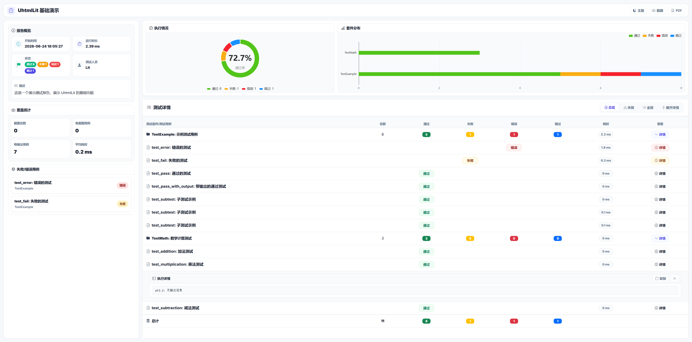

<div align="center"></div>

# UhtmlLit

现代化的 Python `unittest` HTML 测试报告生成器，支持全屏报告 UI、统计图表、截图附件、详情展开、主题切换、页面截图和 PDF 打印。



## 安装

```bash
pip install uhtml-lit
```

本地开发安装：

```bash
pip install -e .
```

## 基础用法

```python
import unittest
from htmltestrunner import UhtmlLit

suite = unittest.TestLoader().loadTestsFromTestCase(YourTestCase)

with open("report.html", "wb") as f:
    runner = UhtmlLit(
        stream=f,
        title="自动化测试报告",
        description="项目接口自动化测试",
        tester="QA Team",
        open_in_browser=True,
    )
    runner.run(suite)
```

## 截图用法

```python
import unittest
from selenium import webdriver
from htmltestrunner import UhtmlLit, attach_screenshot


class TestDemo(unittest.TestCase):
    def setUp(self):
        self.driver = webdriver.Chrome()

    def test_example(self):
        self.driver.get("https://www.baidu.com")
        attach_screenshot(self.driver, "页面截图")

    def tearDown(self):
        self.driver.quit()


suite = unittest.TestLoader().loadTestsFromTestCase(TestDemo)

with open("report.html", "wb") as f:
    UhtmlLit(stream=f, title="Selenium 测试报告").run(suite)
```

截图需要在 `UhtmlLit.run(suite)` 执行的测试上下文中调用。IDE 自带的 unittest runner 不会创建报告上下文，因此无法挂载截图。

## API

### UhtmlLit

| 参数 | 类型 | 默认值 | 说明 |
| --- | --- | --- | --- |
| `stream` | file | `sys.stdout` | HTML 报告输出流 |
| `title` | str | `"Unit Test Report"` | 报告标题 |
| `description` | str | `""` | 报告描述 |
| `tester` | str | `"QA Team"` | 测试人员 |
| `verbosity` | int | `1` | 输出详细程度 |
| `open_in_browser` | bool | `False` | 生成后自动打开浏览器 |

### attach_screenshot

支持传入：

- Selenium WebDriver 对象
- 图片文件路径
- 图片 bytes
- PIL Image 对象

## 示例

```bash
python examples/demo_basic.py
python examples/demo_selenium.py
```
